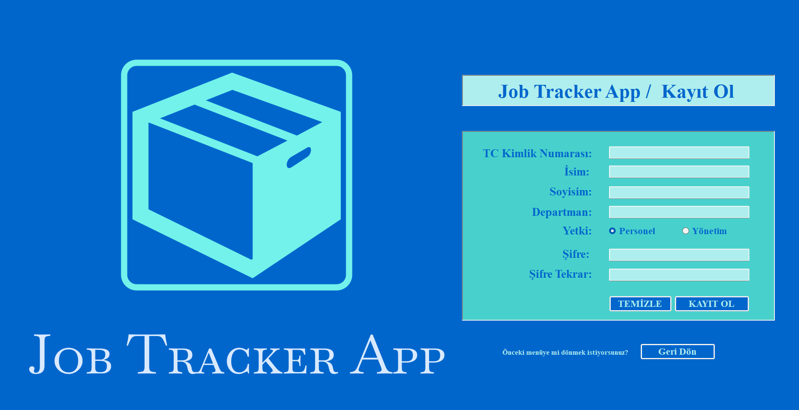
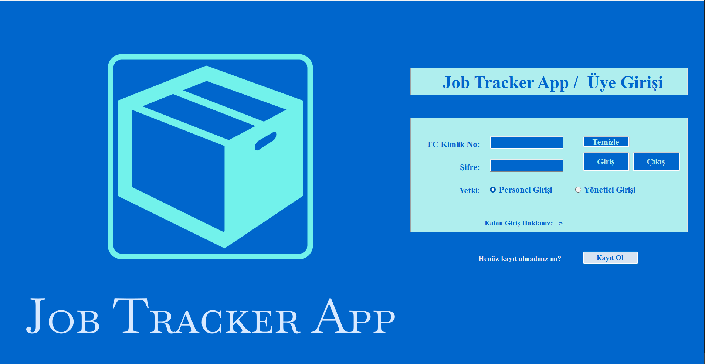
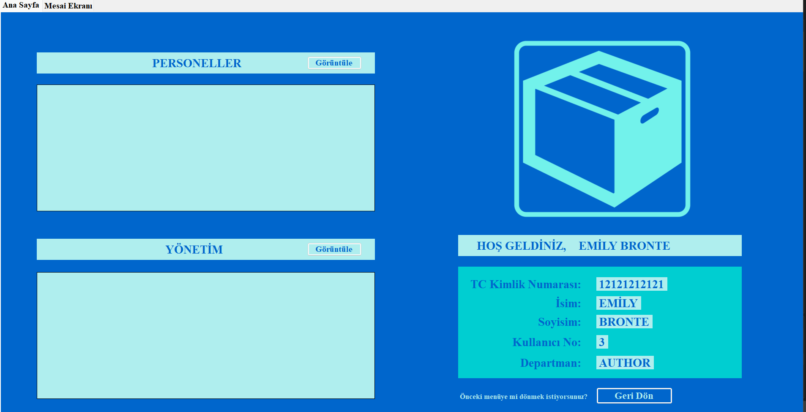
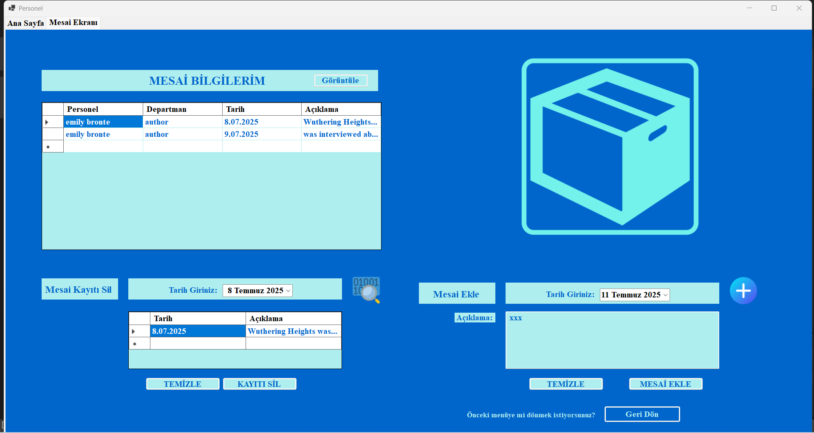
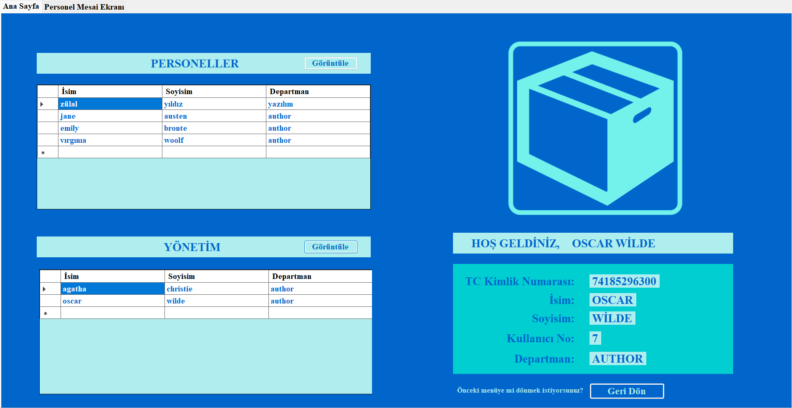
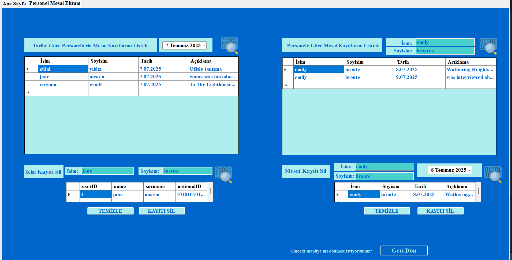

# JobTracker
A WinForms-based Job Application Tracker

## 🚀 Overview
JobTracker is a work tracking automation system built with C# and WinForms. It allows company staff and administrators to manage user registrations, log daily tasks, view attendance history, and filter reports by person or date. The system supports login functionality based on national ID and password (only available on the desktop version).

## 🛠️ Technologies
- **C#**
- **.NET Framework** 
- **Windows Forms (WinForms)**
- **SQLSERVER**

  ## 🎯 Features

- Add, edit, and delete job applications  
- Track application statuses (e.g., “Applied”, “Interviewing”, “Offered”, etc.)  
- Add interview dates, notes, and contact information  
- Search and filter job entries by company name, status, or date  
- User-friendly WinForms interface  
- Database connection for persistent data storage (e.g., SQL Server)


## 📥 Installation

    Clone the repository:
    ```bash
    git clone https://github.com/zulalyildiiz/JobTracker.git
    
    Open the solution file JobTracker.sln with Visual Studio.

    Restore NuGet packages if prompted.

    Build the solution and run the project using:

    F5 (or the Start button in Visual Studio)
    IMPORTANT: Update the connection string in your code according to your database configuration.


   ⚠️ **Notice**
>
> - The user interface and all in-app messages are designed in **Turkish**.
> - Before running the application, make sure to **configure the database connection strings** in the code according to your own environment. Otherwise, the application will not be able to connect to the database.
> - If you are using SQL Server, update fields such as `Data Source`, `Initial Catalog`, and `Integrated Security` to match your setup.
>
> Example connection string format:
> ```csharp
> string connectionString = "Data Source=YOUR_SERVER_NAME; Initial Catalog=YOUR_DATABASE_NAME; Integrated Security=True;";
> ```


[TR]
---

# JobTracker
**WinForms ile geliştirilmiş bir iş takip otomasyon uygulaması**

---

## 🚀 Genel Bakış

**JobTracker**, C# ve WinForms kullanılarak geliştirilmiş bir iş takip otomasyon sistemidir. Sistem, kullanıcıların kaydedilmesini, günlük yapılan işlerin girilmesini, yöneticilerin bu verileri tarihe veya kişiye göre filtreleyerek görüntülemesini sağlar. Giriş işlemleri TC kimlik numarası ve şifre ile yapılır (mobil sürümde bulunmamaktadır).

---

## 🛠️ Kullanılan Teknolojiler
- **C#**
- **.NET Framework** 
- **Windows Forms (WinForms)**
- **SQL Server**

---


## 🎯 Özellikler

- **Kullanıcı Modülü:**  
  - Kullanıcılar bir panel üzerinden sisteme kayıt olabilir.  
  - Kayıt alanları: ID, Ad, Soyad, TC Kimlik No, Çalıştığı Alan, Şifre  
 
- **Çalışma Modülü:**  
  - Kullanıcılar her gün yaptıkları işleri sisteme girebilir.  
  - Kayıt alanları: ID, Açıklama, KullanıcıID (userID)

- **Yönetici Paneli:**  
  - Yönetici, sisteme girilen günlük verileri görüntüleyebilir.  
  - Verileri tarihe veya kişiye göre filtreleyerek listeleyebilir.

- **Giriş Sistemi:**  
  - Kullanıcılar, TC Kimlik Numarası ve şifre ile giriş yapabilir.  

- **Mesai Takibi:**  
  - Yönetici, kullanıcıların hangi günlerde çalıştığını günlük iş kayıtlarına göre görebilir.


---

# Screenshots














----

## 📥 Kurulum

Depoyu klonlayın:
```bash
git clone https://github.com/zulalyildiiz/JobTracker.git
JobTracker.sln çözüm dosyasını Visual Studio ile açın.

Gerekirse NuGet paketlerini geri yükleyin.

Projeyi derleyin ve çalıştırmak için şu adımı izleyin:

F5 tuşuna basın (veya Visual Studio'da Başlat düğmesine tıklayın)

ÖNEMLİ: Uygulamayı çalıştırmadan önce, kodda yer alan connection string kısmını kendi veritabanı yapılandırmanıza uygun şekilde güncelleyin.


⚠️ Uyarı
Uygulamanın arayüzü ve tüm uyarı mesajları Türkçe olarak tasarlanmıştır.

Uygulamayı çalıştırmadan önce, kod içinde bulunan veritabanı bağlantı (connection string) bilgilerini kendi sisteminize göre yapılandırdığınızdan emin olun. Aksi takdirde uygulama veritabanına bağlanamayacaktır.

SQL Server kullanıyorsanız Data Source, Initial Catalog ve Integrated Security gibi alanları kendi ayarlarınıza göre güncelleyin.

---

